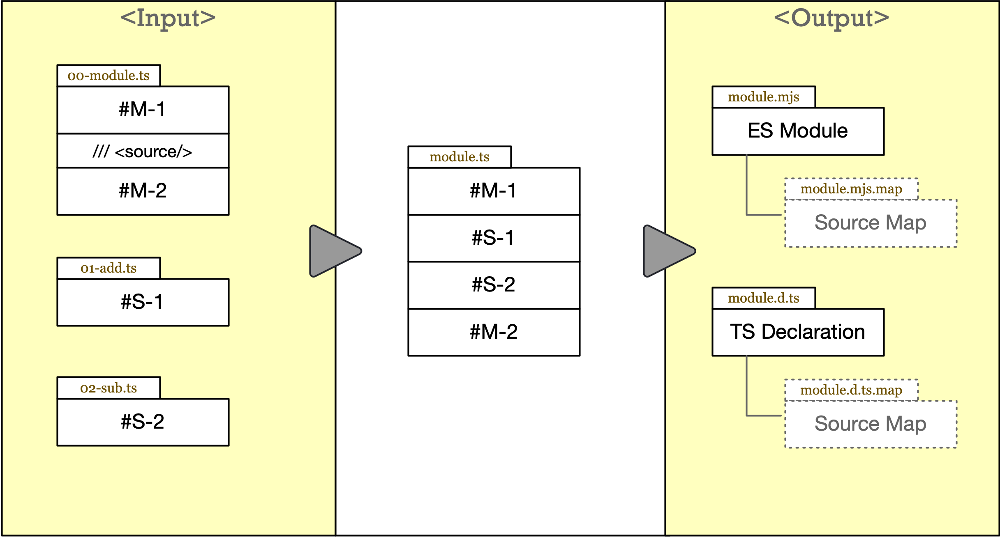

# ESModule Builder

このツールはECMAScript Modules仕様のモジュールファイルを生成します。

ECMAScript Modulesは、Node.js（バージョン14以降）またはモダンなWebブラウザで実装されています。

- [Node.jsドキュメント](https://nodejs.org/api/esm.html#esm_ecmascript_modules)
- [ECMAScript 2021 言語仕様](https://tc39.github.io/ecma262/#sec-modules)

設定ファイルに従い複数のソースファイルを連結し、単一のESモジュールファイルを出力します。
コンパイラとして "TypeScript" と "Babel" を使用することができます。

## 処理イメージ



## インストール

`npm`を使用しているなら

```sh

npm install esmodule-builder --save-dev

```

`yarn`を使用しているなら

```sh

yarn add esmodule-builder --dev

```

## コマンドの実行

`npm`を使用しているなら

```sh

npm run esmc

```

`yarn`を使用しているなら

```sh

yarn run esmc

```

## 設定ファイル

ビルドの設定は、ファイル`esmconfig.json`に記述します。
この設定ファイルが存在するディレクトリが基準ディレクトリとなり、設定ファイル内で指定される相対パスの解決に使われます。

設定ファイルの例を以下に示します。

```json
{
    "compiler": "typescript",
    "source": {
        "directory": "sources",
        "entry": "00-module.ts",
        "include": "**/*.ts",
    },
    "module": {
        "directory": "modules",
        "name": "example",
        "sourceMap": "file"
    }
}
```

## TypeScriptでのコンパイル

まず、npmモジュール`typescript`をインストールしてください。

設定ファイルの`"compiler"`に`"typescript"`を指定します。

### サンプル

- [単一ソースファイル (/examples/11-typescript-1-file/)](/examples/11-typescript-1-file/)
- [複数ソースファイル (/examples/12-typescript-n-files/)](/examples/12-typescript-n-files/)

### 既定のオプション指定

`esmc`は次の設定を既定値として使用します。

```json:esmconfig.json
{
    "compilerOptions": {
        "target": "esnext",
        "module": "esnext",
        "moduleResolution": "node",
        "esModuleInterop": true,
        "strict": true,
        "alwaysStrict": true,
        "declaration": true,
    }
}
```

### 詳細なオプション指定

設定ファイルに`"typescript"`エントリを追加できます。
`"typescript"`エントリの内容は既定のオプション指定を上書きしますので、慎重に指定してください。

次の例は、TypeScriptのオプション`target`を指定し、モジュールファイルをES5形式で出力します。

```json:esmconfig.json
{
    "compiler": "typescript",
    "source": "...",
    "module": "...",
    "typescript": {
        "compilerOptions": {
            "target": "es5",
            "...": "..."
        }
    }
}
```

TypeScriptの設定ファイル`tsconfig.json`についての詳細は、[TypeScript公式ドキュメント](https://www.typescriptlang.org/docs/handbook/tsconfig-json.html)を参照してください。

### デバッグ用の出力

TODO:

## Babelでのコンパイル

まず、npmモジュール`@babel/core`をプロジェクトに追加してください。
あなたが使用するプリセット、プラグインのnpmモジュールもプロジェクトに追加します。

設定ファイルの`"compiler"`に`"babel"`を指定します。

### 既定のオプション指定

```json:tsconfig.json
{
    "compilerOptions": {
        "target": "esnext",
        "module": "esnext",
        "moduleResolution": "node",
        "esModuleInterop": true,
        "strict": true,
        "alwaysStrict": true,
        "declaration": true,
    }
}
```

### 詳細なオプション指定

設定ファイルに`"babel"`エントリを追加できます。
`"babel"`エントリの内容は既定のオプション指定を上書きしますので、慎重に指定してください。

次の例は、Babelのオプション`target`を指定し、モジュールファイルをChrome 40以上・iOS 10以上で動作する形式（ES5）で出力します。

```json:esmconfig.json
{
    "compiler": "babel",
    "source": "...",
    "module": "...",
    "babel": {
        "presets": [
            ["@babel/preset-env", {
                "targets": [
                    "chrome 40",
                    "iOS 10"
                ]
            }]
        ]
    }
}
```

プリセット名は短縮記法が使えます。
`env`は、`@babel/preset-env`の短縮表記です。

```json:esmconfig.json
{
    "compiler": "babel",
    "source": "...",
    "module": "...",
    "babel": {
        "presets": [
            "env"
        ]
    }
}
```

## Flowソースのコンパイル

Babelのプリセット`@babel/preset-flow`を使います。

```json:esmconfig.json
{
    "compiler": "babel",
    "source": "...",
    "module": "...",
    "babel": {
        "presets": [
            "@babel/preset-flow"
        ]
    }
}
```

プリセット名は短縮記法が使えます。
`flow`は、`@babel/preset-flow`の短縮表記です。

```json:esmconfig.json
{
    "compiler": "babel",
    "source": "...",
    "module": "...",
    "babel": {
        "presets": [
            "flow"
        ]
    }
}
```

## 設定ファイル（詳細）

TODO:
